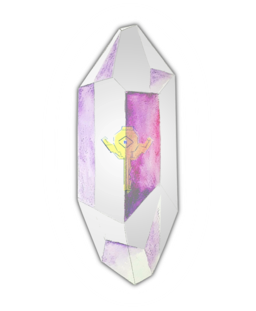
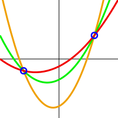

### Dark Crystal

A peer to peer tool for securely backing up secrets using the power of community networks and human trust.

Note: 
- This is the presentation content doc.  Separations between slides are represented by a horizontal rule (three hyphens)
- Hosted live on github pages https://blockades.github.io/dark_crystal_presentation/
- Dark Crystal provides a secure private key management system with no single point of failure.

---

### The key custody problem is getting bigger

- Encryption
- Smart contracts and Cryptocurrency
- Digital Identity
- Any kind of decentralised authentication

These are all increasingly prominent technologies which aren't suited to password reset functionality typical of traditional web services.  The more we rely on them, the bigger the implications of loosing private keys.

---
### Existing Solutions

- Make personal backups
- Use a cloud service
- Deterministic password managers
- Use an existing secret sharding tool

---
### Shamir/Blakely Secret sharing

- Split a secret into shards for each friend
- Individuals hold no information about the secret
- Each shard is a point on a polynomial over a Galois field
- Secret can be reproduced with a minimum quorum
 
---
### Secure Scuttlebutt

 

- Relationship centered, not content centered
- Peers publish to their 'feed', a hash linked append only log
- Feeds are replicated by a gossip protocol
- Authentication by secret handshake

---

 

---

---
### Use cases

- Due diligence in teams
- Inheritance planning
- Activists in oppressive regimes

---
### Trustful model

- Reinforces community interdependence
- Reduces dependence on centralised 'giants'

---
### More information

- [darkcrystal.pw](https://darkcrystal.pw)
- #dark-crystal #darkcrystal and #mmt on Scuttlebutt

### Source code

- Client plugin / UI: [github.com/blockades/patchbay-dark-crystal](https://github.com/blockades/patchbay-dark-crystal)
- API:  [github.com/blockades/scuttle-dark-crystal](http://github.com/blockades/scuttle-dark-crystal)
- Data schemas: [github.com/blockades/ssb-dark-crystal-schema](https://github.com/blockades/ssb-dark-crystal-schema)
